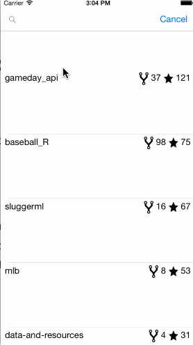

# GithubRepoFinder
iOS Class Lab #2

This is the Lab #2 Github Repo Finder

Time spent: 2.5 hours

Completed:

* [x] Required: Add description to NSLog
* [x] Required: Create table with custom cells for repo results
* [] Required: Create settings page
* [] Required: Allow filtering by language

